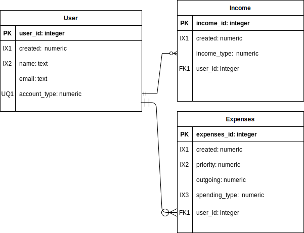
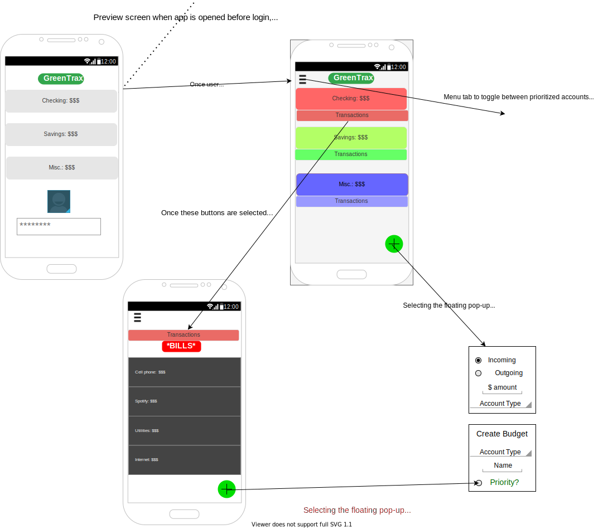

## Summary

_GreenTrax_ is a simple Android App, intended for use by individuals looking to track their monthly expenses coming in and going out while being able to visualize this data with various charts and graphs.

---

## Design Documentation:

## Entity Relations Diagram 
App entities, attributes, and relationships.

---

## Wireframe Diagram
High-level view of user interaction & flow.

---

## Intended users

- A college student that is looking to budget appropriately for the semester.

  > As a new college student just learning to manage my own budget, it would be nice to have the ability to enter my finances for the month and have them organized in a simple yet efficient way that allows me to understand my spending habits. 

- Individuals who are looking to understand their spending habits.

  > As someone who has always struggled with having enough money at the end of the month, being able to record my expenses and having them organized in an understandable way would help me trim my budget.  

## Functionality

- Input of monthly expense including outgoing expenses
- Date and Time of incoming/outgoing expenses
- Organization of expenses into different categories (Rent,Utilities, Groceries, Important Bills, Vacations, etc.)
- Representation of monthly expenses in charts and graphs
- Simple interface to allow users to quickly understand their budget

## Persistent data

- Monthly expenses
- Current cash flow
- Past monthly expenses
- Recent Entries
- Past Selections
- Names and categories

## Device/external services

- Take a photo to upload receipts/bills for easy recording.
- Use Google Sign In to identify current user.

## Stretch goals/possible enhancements 

- Import account information from already existing spending trackers.
- Import information from bank accounts to have up-to-date spending records.
- Import current credit score 
- Supporting multiple users on the same device

